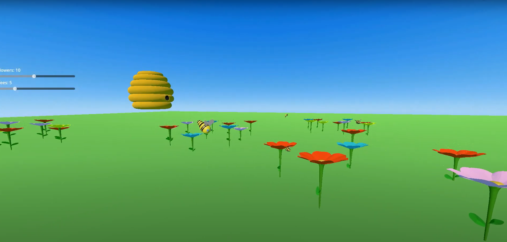
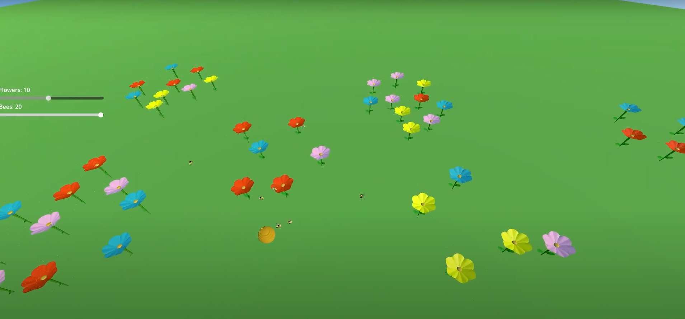
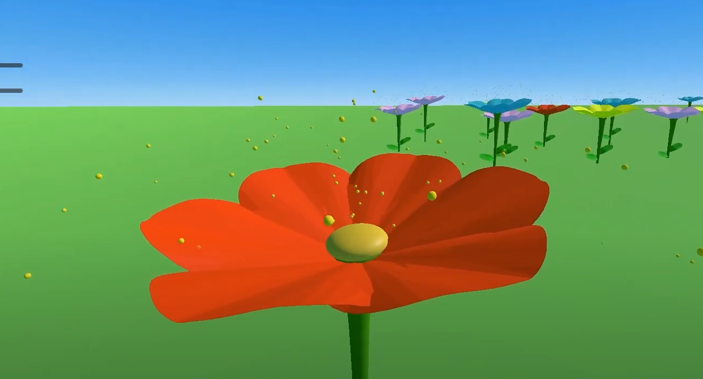
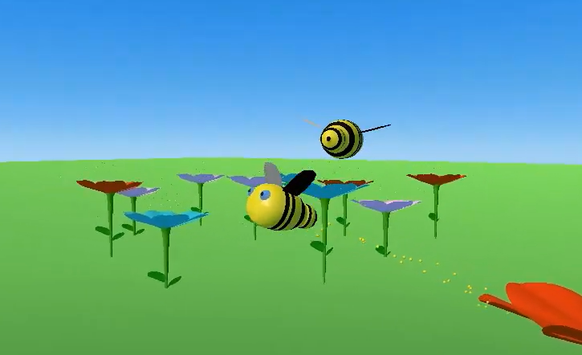

# Bees
## Group (The Bee Boys)
| Name | Student Number |
| ---- | -------------- |
| Luke Moss Hughes | C20487654 |
| James Clarke | C20375736 |
| David Lynch | C19500876 |

# Description
Our project is a simulation of bee behavior using boids.

The map consists of a beehive at the center, surrounded by patches of flowers.

Bees will exit the hive over time and roam the map looking for pollen. When a bee finds a pollinated flower, the bee collects the pollen and brings it back to the hive. The flower’s pollen will then replenish over time.

Sliders on the screen control the amount of bees and the amount of flower patches in the world.

## Video

## Screenshots
## Bees Exiting Hive

## Sample Map Overview

## Pollinating Flower

## Bee Closeup

# Instructions
Once you enter the simulation, there is a fixed camera above the scene. Here you can edit the sliders to control variables in the simulation
To explore the garden yourself, press ALT. This will change to a first person camera.

## General
|Button|Movement|
|------|--------|
|ALT|Change Camera Mode|
|M|Toggle Music|

## "Creative Mode" Camera
|Button|Movement|
|----|----|
|A|Left|
|D|Right|
|W|Forward|
|S|Back|
|SPACE|Up|
|CTRL|Down|
|SHIFT|Fast Movement|

# How it works
## Camera Controls
The camera view can be switched between a fixed camera and a first person “Creative Mode” camera. The root script cycles through each of these when the ALT key is pressed.

The first person “CreativeMode” camera is attached to a CharacterBody3D. This has a script attached to respond accordingly to WASD movement and mouse control.

## Garden

## Flower

## Hive
There is a timer attached to the hive, and when it times out a bee will be spawned. A reference to this bee is added to an array to keep track. Bees will be spawned up to a maximum limit, which is set using the UI sliders.

When a bee comes in contact with the hive, they “enter”. The bee is despawned and its reference is removed from the bee array.

## Bee
### Beehavior
When the bees are first spawned, they implement a “noise wander” boid behavior, where their movements are determined by random points. Each flower has a sphere around it called the “Attraction Sphere”. When a bee enters this and the flower has pollen, the bee will change its behavior to arrive, making a beeline to the center of the flower.

When the bee enters the pollen (center of the flower), its behavior will be set to arrive with the hive as the target, as the bee returns with its collected pollen. Yellow particles will be applied to the bee to signify that it is carrying pollen.

When the bee makes contact with the hive, the hive will despawn the bee.

If the bee's distance from the hive ever eclipses the MAX_DIST_FROM_HIVE constant, the bee will enter the arrive behavior with the target set to hive.

### Banking

### Wing Animation
Every frame the wings of the bee are animated in accordance with how fast the bee is moving.
The angle that a bee's wings will rotate each frame is calculated based off the acceleration force being applied to the bee boid. The wings will be rotated downwards until a max rotation is reached, then the wings will be rotated upwards. This is repeated to give the flapping motion seen.

# List of classes/assets
| Class Name | Description | Properties | Methods |
|:----:|:----:|:----:|:----:|
| root | The "root" class is responsible for toggling camera modes, updating values tied to hud sliders, and muting/unmuting music. | camera_mode: int - Holds state of camera. | _ready() - Sets mouse mode. |
|  |  |  | _process() - Monitors input events and HUD slider values, to respond appropriately. |
|||||
| hive | The "hive" class is responsible for spawning and destroying bees, when appropriate. | bees_max: int -  Bees will not be spawned beyond the value of "bees_max". | _spawn_bee() - If the number of instantiated bees is lower than "bees_max", this method spawns a new bee. |
|  |  | bee: PackedScene - Holds a PackedScene/Resource that points to bee.tscn. Used to instantiate bees. | _on_timer_timeout() - Triggered every 2.5 seconds by a timer, calls the _spawn_bee() function. |
|  |  | bees: Array - Holds all instances of bees. | _on_area_3d_area_entered(area: Area3D) - Used to detect when bees collide with the hive and call queue_free() to despawn and free the bee instance from memory. |
|||||
| bee | The "bee" class is a boid. Bee's arrive at the "exitPoint" of the hive after spawning. When a bee reaches the exit point it will start wandering. When they find a pollinated flower, they take the pollen and "arrive" at the hive. |movements: Array[Callable] - Holds each behavior that the boid will implement each frame.  | _ready() - In this method, some variables are set and the bee is set to arrive at the "exitPoint" of the hive. |
|  |  | status: enum - Keeps track of the state the bee is currently in, can be Wandering, Arriving or Returning | SetupWings() - This method stores the wings of the boid in variables and rotates them to their starting angle. |
|  |  | MAX_DIST_FROM_HIVE: int - The maximum distance a bee can be from the hive before returning to the hive. | _physics_process(delta) -  This method runs 60 times per second. It calls the "animateWings", "applyForce", and "applyRotation" methods to make changes to the bee boid over time. It ensures bee return to the hive if they wander too far from it with "setStatusArrive(hive)" |
|  |  | MAX_FORCE: float -The maximum force that can be applied to the bee boid | animateWings() - This method is used to programmatically animate the wings of bee's. This approach was chosen over using an animatableBody3D, due to time constraints. |
|  |  | mass: int - The mass of the bee boid | _arrive() - This method calculates the force applied to bees when arriving at a target. |
|  |  | vel: Vector3 - The velocity of the bee boid | _noiseWander() - This method calculates the force applied to bees when wandering. |
|  |  | force: Vector3 - The force being applied to the bee boid | setStatusArrive(target) - This method changes the boid behavior of a bee to "Arriving" at a target. |
|  |  | acceleration: Vector3 - The acceleration being applied to the bee boid  | setStatusReturning(target) - This method changes the void behavior of a bee to "Returning" at a target. |
|  |  | speed: float - The speed of the bee boid (magnitude of the velocity vector) | setStatusWander() - This method changes the boid behavior of a bee to "Wandering". |
|  |  | max_speed: float - The maximum speed the bee boid can have | calculate() - This method integrates the forces from each active boid behavior into an accumalated force, used to change the velocity of the bee. |
|  |  | max_rotation_speed - The max banking speed the bee boid can have | applyForce(delta) - This method applies changes in force to the bee. |
|  |  | arriveTarget: Node3D - The target that the bee will arrive to. | applyRotation(delta) - This method applies rotations to the pitch, yaw, and roll of the bee based on it's velocity. |
|  |  | ARRIVE_MAX_SPEED: float - The maximum speed that the bee boid will arrive at. | _on_bee_area_entered(area: Area3D) - Used to detect when bees reach the "exitPoint" of the hive or enter the attraction sphere, or pollen sphere of flowers. When the exit point of the hive is reached, the bee's boid behavior is set to "Wandering". When the attraction sphere of a flower is entered, the bee's boid behavior is set to "Arriving" with the flower's pollen as it's target. When the pollen sphere of a flower is entered, the bee's boid behavior is set to "Returning" with the hive as it's target. |
|            |                                                                                                                                                                                                                                      |     SLOWING_DISTANCE: float - The speed that that the bee boid will slow at while arriving at target     |                                                                                                                                                                                                                                                                                                                                                                                                                                                                                                                             |
|            |                                                                                                                                                                                                                                      |                          WANDER_AMP: int - A speed multiplier for noise wander                           |                                                                                                                                                                                                                                                                                                                                                                                                                                                                                                                             |
|            |                                                                                                                                                                                                                                      |                       WANDER_DIST: int - distance multiplier used in noise wander                        |                                                                                                                                                                                                                                                                                                                                                                                                                                                                                                                             |
|            |                                                                                                                                                                                                                                      |   AXIS: enum - The axis on which noise wander is applied, this is set to horizontal for our simulation   |                                                                                                                                                                                                                                                                                                                                                                                                                                                                                                                             |
|            |                                                                                                                                                                                                                                      |                        WANDER_FREQ: float - Frequency value used in noise wander                         |                                                                                                                                                                                                                                                                                                                                                                                                                                                                                                                             |
|            |                                                                                                                                                                                                                                      |                         WANDER_RADIUS: float - Radius value used in noise wander                         |                                                                                                                                                                                                                                                                                                                                                                                                                                                                                                                             |
|            |                                                                                                                                                                                                                                      |                     WANDER_MAX_SPEED: float - Max speed of the noise wander behavior                     |                                                                                                                                                                                                                                                                                                                                                                                                                                                                                                                             |
|            |                                                                                                                                                                                                                                      |                                theta: float - angle used in noise wander                                 |                                                                                                                                                                                                                                                                                                                                                                                                                                                                                                                             |
|            |                                                                                                                                                                                                                                      |                         wanderTarget: Vector3 - The target used in noise wander                          |                                                                                                                                                                                                                                                                                                                                                                                                                                                                                                                             |
|            |                                                                                                                                                                                                                                      |                         worldTarget: Vector3 - World target used in noise wander                         |                                                                                                                                                                                                                                                                                                                                                                                                                                                                                                                             |
|            |                                                                                                                                                                                                                                      |                         noise: FastNoiseLite - Perlin noise used in noise wander                         |                                                                                                                                                                                                                                                                                                                                                                                                                                                                                                                             |
|            |                                                                                                                                                                                                                                      |                                    hive: Node3D - The hive scene node                                    |                                                                                                                                                                                                                                                                                                                                                                                                                                                                                                                             |
|            |                                                                                                                                                                                                                                      |                    exitTarget: Node3D - The point at which bees spawn (exit the hive)                    |                                                                                                                                                                                                                                                                                                                                                                                                                                                                                                                             |
|            |                                                                                                                                                                                                                                      |                               wingLeft: Node3D - The left wing of the bee                                |                                                                                                                                                                                                                                                                                                                                                                                                                                                                                                                             |
|            |                                                                                                                                                                                                                                      |                              wingRight: Node3D - The right wing of the bee                               |                                                                                                                                                                                                                                                                                                                                                                                                                                                                                                                             |
|            |                                                                                                                                                                                                                                      |        flappingUp: boolean - direction the wings are flapping (if false wings are flapping down)         |                                                                                                                                                                                                                                                                                                                                                                                                                                                                                                                             |
|            |                                                                                                                                                                                                                                      |                      wingRotation: float - The total amount the wings have rotated.                      |                                                                                                                                                                                                                                                                                                                                                                                                                                                                                                                             |
|  |  |  |  |
| garden | The "garden" class is used to store data relating to flowers and flower patches, as well as dynamically spawning flowers and flower patches. | patch_count: int - Stores of the number of flower patches that should be instantiated. | _ready() - This method is used to initiate the generation of flower patches when the garden is instantiated. |
|  |  |  | _process() - This method is used to check that the correct number of flower patches are currently instantiated. If the number is too low, new flower patches will be generated. If the number is too high, flower patches will be freed from memory. |
|  |  |  | _validate_patch_point() - This method checks if a patch point is valid or not. |
|  |  |  | _validate_flower_point() - This method checks if a flower point is valid or not. |
|  |  |  | generate_flower_patches() - This method generates the coordinates for patches and flowers to be spawned on. |

# Team Member Contributions
## Luke Moss Hughes (C20487654)
### What I Did

### What I am Most Proud Of

### What I Learned

## James Clarke (C20375736)
### What I Did
My main contribution was implementing the majority of the bee behavior. This includes the noise wander and arrive implementations, the logic for encountering a flower, and the wing animation.

### What I am Most Proud Of
I am most proud of creating a bee creature that closely mimics the behaviors of real life bees. 

### What I Learned
I learned a lot about boid behaviors, and how to implement them in different contexts to create realistic and lifelike behaviors. 

## David Lynch (C19500876)
### What I Did
I set up the repo and instructed my teammates on how to employ continuous integration in the project. This was chosen instead of feature branching since it leads to smaller merges and each team member will be merging to the same branch continually. I set up automation using GitHub actions for the project to automate code quality checks.

I implemented the HUD, changing bee and flower counts with sliders,and created a simple version of creative mode controls which were eventually elaborated on by other teammates. 

I also implemented the hive spawning logic. 

### What I am Most Proud Of
I am proud of setting up continuous integration, and seeing the speed of features being implemented. I’m also proud of making the game respond to the HUD. 

### What I Learned
I learned how to effectively resolve merge conflicts with godot scenes, and how to manage loading and unloading scene instances.

# Project Planning
Before starting on the project, the features we wanted to achieve were defind, and sorted into stages of project

## V0.1
- Bee Wandering
- Beee spawning from hive
- Fixed Camera
- Spawning flowers on init

## V0.2
- Arriving to flowers, and taking nectar back to hive
- Creative mode camera

## V0.3
- Manage flower resource and pollen replenishment
- Patches of flowers (collections of flowers)

## Future Development
- Bee POV camera
- Hive memory of flowers that have been found (Some bees will then go directely from the hive to a found flower)
- When it rains bees go back to hive

